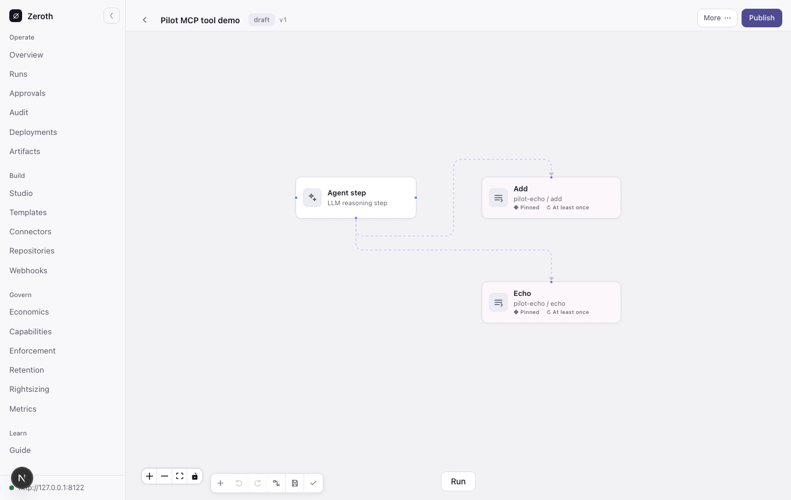
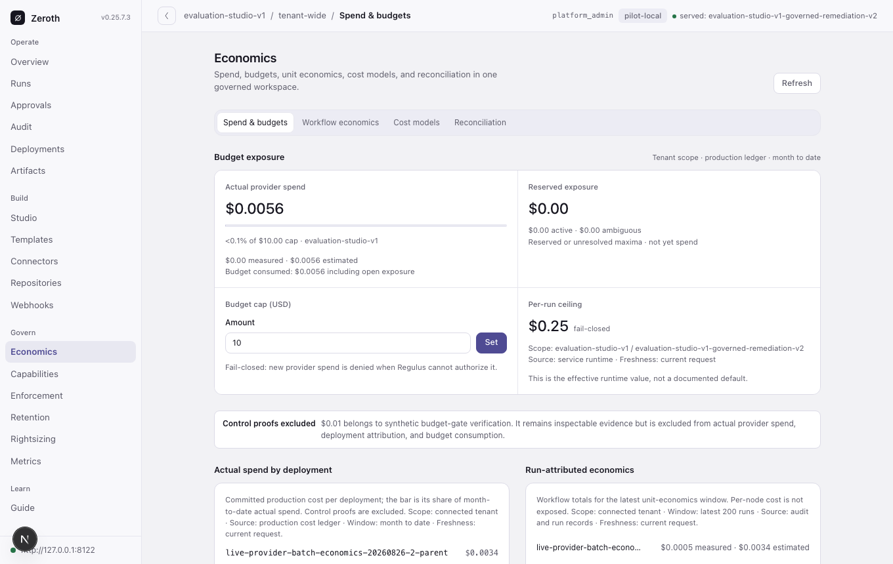
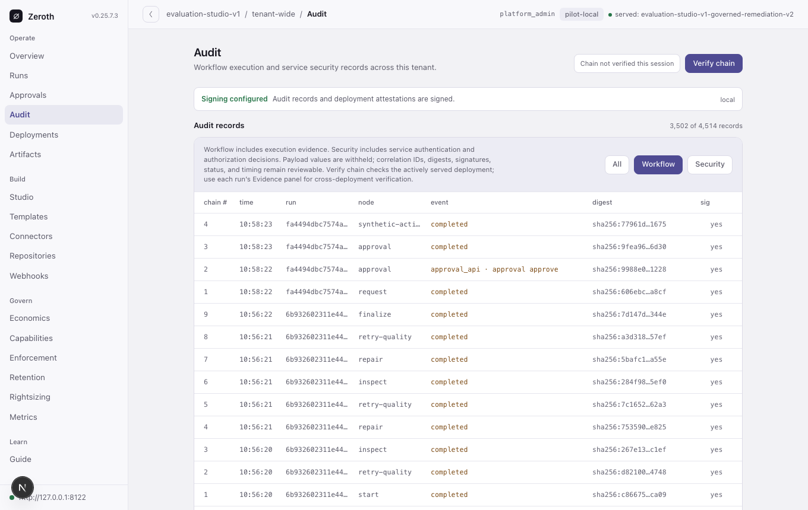
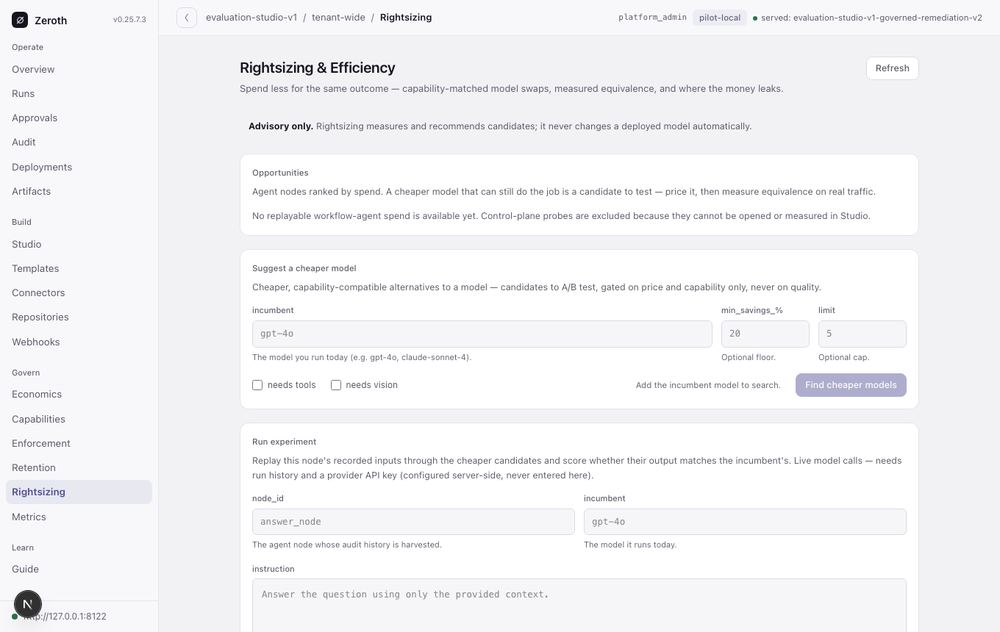
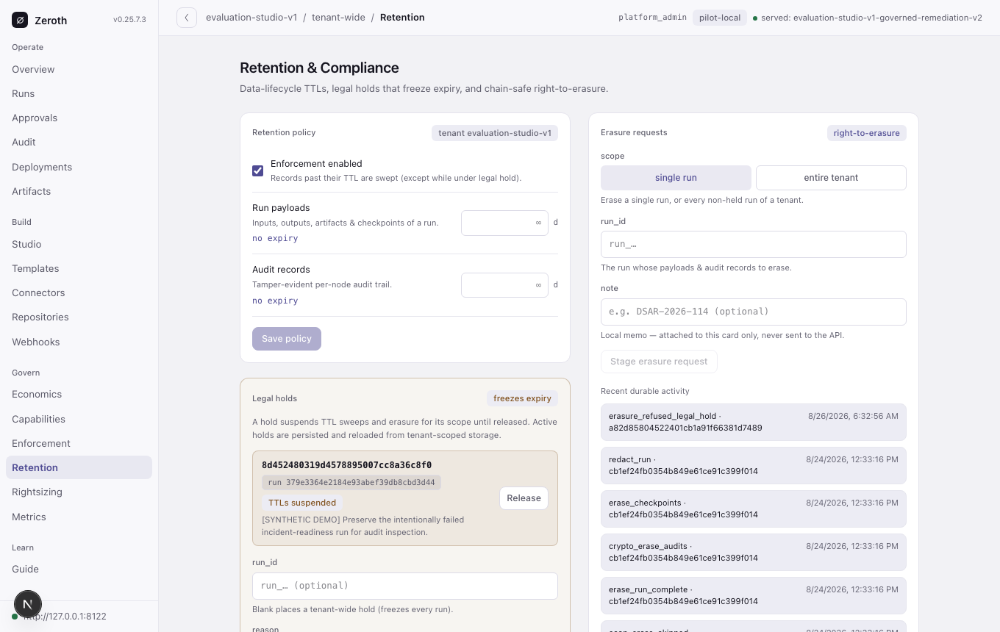
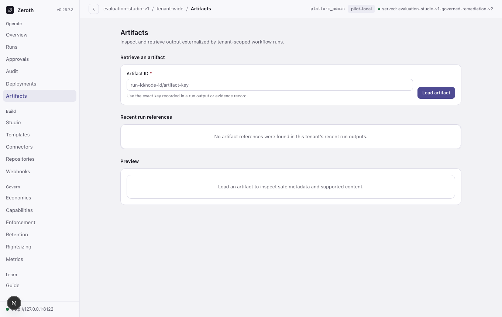

<p align="center">
  <picture>
    <source media="(prefers-color-scheme: dark)" srcset="docs/assets/logo/zeroth-logo-dark.svg">
    
  </picture>
</p>

<p align="center">
  <a href="https://rrrozhd.github.io/zeroth/"></a>
  <a href="https://github.com/rrrozhd/zeroth/actions/workflows/ci.yml"></a>
  <a href="https://github.com/rrrozhd/zeroth/actions/workflows/release-zeroth-sdk.yml"></a>
  <a href="https://github.com/rrrozhd/zeroth/actions/workflows/release-zeroth-sdk.yml"></a>
  <a href="LICENSE"></a>
</p>

**Test AI cost cuts before production, then verify that outcomes still hold.**

Zeroth is an economic debugger and change-control engine for production AI
workflows. It compares exact workflow versions by measured cost per accepted
outcome, refuses to decide when evidence is incomplete, and retains the
decision trail needed to govern rollout.

> **Primary product loop:** find → simulate → approve → verify.

The boundary is deliberate:

- **Free and self-hosted:** SDK, instrumentation, local analysis, existing UI,
  and bounded model-swap backtests.
- **Paid managed service:** continuously hosted evidence, scheduled version
  decisions, retained history, enforced usage limits, and post-change
  verification. Provider-bill reconciliation remains supporting evidence, not
  the product category.

> **Current status:** authenticated SDK ingestion, workflow-version decisions,
> recurring decision schedules, project API keys, enforced plan quotas,
> provider-bill import, measured-cost allocation, and hosted backtest execution are
> implemented for bounded model changes. WorkOS AuthKit activation and Paddle
> checkout, signed webhooks, and customer portal are implemented behind optional
> hosted dependencies. Server-rendered `/` and `/account` routes provide
> self-serve signup, key delivery, checkout, recovery, usage, billing, and
> scheduled decisions without bundling the open-source UI. The
> approved first offer is Solo at $39/month after a
> 14-day trial, with three hosted backtests and 300 calls per
> billing period. Team checkout remains disabled until its governance limits are
> enforced. Managed infrastructure, production vendor credentials, notifications,
> and service terms are not yet live.
> This is not yet a purchasable hosted service.

Intended self-serve activation after the release block is cleared:
`pip install zeroth-sdk`.

Provider-bill reconciliation remains available as supporting finance evidence.
It keeps billed totals, measured telemetry, variance, unmatched buckets, and
unresolved outcomes separate; see the
[reconciliation guide](docs/how-to/provider-bill-reconciliation.md) and
[free debugger guide](docs/how-to/economic-debugger.md).

| Surface | Current role | Commercial boundary |
|---|---|---|
| Economic evidence and single-team debugging | Implemented, free, and self-hostable | Trust and adoption layer |
| Workflow-version economic decisions and schedules | Implemented API; hosting and notifications planned | Initial recurring paid service boundary |
| Provider-bill import and workflow/outcome allocation | Implemented API; hosting, connectors, and rollups planned | Supporting finance evidence and expansion tier |
| Bounded model-change backtests | Hosted API replays 5–25 labeled, tool-free cases and retains a privacy-preserving decision | Initial proof-of-savings subscription surface |
| Identity, checkout, and entitlement projection | WorkOS AuthKit activation plus Paddle checkout/portal and signed webhooks; normalized events are replay-safe | Production vendor projects and real-transaction acceptance remain required |
| Structural workflow backtests and signed evidence | Not implemented | Expansion after model-change demand is proven |
| Studio and console | Existing open-source UI; unchanged for this narrowing | Not the SaaS product |
| `zeroth-sdk` | Execution, outcome, backtest, decision, schedule, and history routes are served and exercised end to end | Release-blocked on hosted operations and package release readiness, not a dangling route |

### Preserved platform capabilities

Zeroth's broader runtime continues to treat an agentic application as an
explicit executable graph. The table below describes those existing enforcement
boundaries; it is not the narrowed commercial product surface.

| Capability | Observed | Partial | Enforced |
|---|---:|---:|---:|
| Gateway admission, compatibility, and request audit | ✓ | — | ✓ |
| LangGraph causal spans and stream order | ✓ | — | — |
| Tool inventory coverage | ✓ | ✓ | — |
| In-process `govern_tools` / `ZerothMiddleware` calls | ✓ | — | ✓ |

> **Gateway-only mode cannot enforce internal Agent Server tool calls.** Install
> the in-process `langgraph` adapter for tool-body allow, deny, and approval
> enforcement. `Partial` above describes inventory coverage, not a governance level.

---

## Quickstart

Install the lean hosted-service client without the runtime, economic plane, or
UI:

```bash
pip install zeroth-sdk
```

The wheel remains release-blocked until a production hosted endpoint, provider
credentials, service terms, and release verification exist. For the current
self-hosted debugger and preserved platform, use the source checkout
instructions below.

## Documentation

Browse **<https://rrrozhd.github.io/zeroth/>**. For the preserved platform, see
[Getting Started](https://rrrozhd.github.io/zeroth/tutorials/getting-started/),
[Zeroth Check](docs/how-to/check/quickstart.md), or
[LangGraph deployment](docs/how-to/deployment/langgraph-release.md).

Project links: [source](https://github.com/rrrozhd/zeroth) ·
[releases](https://github.com/rrrozhd/zeroth/releases) ·
[changelog](CHANGELOG.md) · [issues](https://github.com/rrrozhd/zeroth/issues) ·
[security](SECURITY.md)

---

## Platform quickstart (preserved)

One command clones the repo, installs everything, and serves a working demo
deployment — a deployed Q&A graph on `http://127.0.0.1:8000` with the web
console at `/console/`:

```bash
curl -fsSL https://raw.githubusercontent.com/rrrozhd/zeroth/main/scripts/quickstart.sh | bash
```

(Prefer to read before you run? `curl -fsSLO …/quickstart.sh`, inspect it, then
`bash quickstart.sh`. From an existing checkout just run `./scripts/quickstart.sh`.)

The script installs [uv](https://docs.astral.sh/uv/) if missing, provisions
Python 3.12, builds the web console when Node 20+ is available, prompts for an
`OPENAI_API_KEY` (optional — without one you can still explore the console and
Studio), and starts the service. Open **<http://127.0.0.1:8000/console/>** and
connect with the demo key `demo-operator-key` — the console's Guide page and
workflow templates take it from there.

From a current source checkout, the CLI can seed and serve a runnable demo
without writing an application first:

```bash
uv run zeroth-core seed-demo   # creates schema + a deployed single-agent graph;
                               # prints the export + curl commands for your first run
uv run zeroth-core serve
```

Or build the declared wheel before creating the container image:

```bash
uv build --wheel
docker build -t zeroth-core .
docker run -p 8000:8000 -v zeroth-data:/data zeroth-core
```

See `Dockerfile` and `docker-compose.yml` for the image and multi-service paths.

### Persistent evaluation development instance

The live evaluation workspace has a reloadable Compose profile that preserves
the Zeroth database, economics ledger, signing/service identities, artifacts,
action receipts, and Chroma corpus outside the checkout. Provider credentials
live only in the ignored, mode-`0600` `.dev-secrets/zeroth.env` file.

```bash
# Start or reconcile all services after a dependency/configuration change.
docker compose -f compose.dev.yml up -d --build

# Reload backend source amendments without rotating keys or resetting state.
docker compose -f compose.dev.yml restart backend

# Frontend source is bind-mounted and hot-reloads on port 3000.
open http://127.0.0.1:3000/console/

# Inspect health and logs.
docker compose -f compose.dev.yml ps
docker compose -f compose.dev.yml logs -f backend

# Stop containers; persistent bind-mounted state is retained.
docker compose -f compose.dev.yml down
```

The stable API base is `http://127.0.0.1:8122`. The console stores only that
non-secret base and a session marker in browser local storage. It exchanges the
service key for a short-lived secure HttpOnly cookie and never persists the key.
Never use `down -v` as a reset shortcut; use an explicit state snapshot/reset
procedure when a clean campaign is intended.

---

## Install (PyPI temporarily unavailable)

The standalone `zeroth-sdk` source is preserved under `packaging/sdk`, but it
is not a supported install target yet. Its execution, outcome, backtest,
decision, schedule, and history calls now terminate in authenticated plane
routes, including a real client-to-server backtest test. The package must not be
published until the hosted endpoint and managed provider credentials exist and
the release hold is deliberately cleared.

The preserved local platform is a separate distribution. From a source
checkout, use `uv sync` for development or build/install `zeroth-core`. The
published `zeroth-core` package is still a stale `0.1.0` placeholder (verified
2026-08-24), so do not use it for the current source tree.

The following extras belong to the preserved `zeroth-core` platform, not to
`zeroth-sdk`. Enable them in a source checkout with `uv sync --extra <name>`:

```bash
uv sync --extra console            # Bundled web console UI (no Node needed)
uv sync --extra langgraph          # Govern LangGraph and create_agent tool calls
uv sync --extra langgraph-gateway  # Agent Server gateway transport
uv sync --extra memory-pg          # Postgres + pgvector memory backend
uv sync --extra memory-chroma      # Chroma memory backend
uv sync --extra memory-es          # Elasticsearch memory backend
uv sync --extra dispatch           # Distributed worker (redis + arq)
uv sync --extra sandbox            # Sandbox sidecar marker
uv sync --extra otel               # OpenTelemetry trace/metric export
uv sync --extra regulus            # Bundled economic control plane backend
uv sync --extra cloud              # Hosted WorkOS AuthKit + Paddle adapters
uv sync --extra all                # Headless runtime bundle; excludes console and langgraph middleware
```

Available extras: `console`, `langgraph`, `langgraph-gateway`, `memory-pg`,
`memory-chroma`, `memory-es`, `dispatch`, `sandbox`, `otel`, `regulus`, `cloud`,
`all`. The hosted vendors remain out of the SDK and default runtime wheels.

---

## Product boundary

An Admin defines success once for each workflow version. Definitions are
immutable, and versions without one remain unresolved rather than receiving an
inferred success rate.

Provider statement operators can use `zeroth-econ reconcile`; the
[reconciliation guide](docs/how-to/provider-bill-reconciliation.md) defines the
OpenAI Costs JSON normalizer, provider-neutral import, and closure states.

Zeroth's active product scope is economic debugging: attribution, timelines,
cohort and breakage analysis, and evidence-backed change simulation. The
broader runtime remains available for compatibility, as an evidence source,
and as an integration testbed.

| What Zeroth **is** | What Zeroth **is not** |
|---|---|
| An economic debugger and evidence spine for AI workflows | A generic LLM observability dashboard |
| A way to explain cost by outcome, version, step, subject/cohort, and time | A model router or provider marketplace |
| A backtester for evidence-backed cost-saving changes | A replacement for LangGraph or other workflow runtimes |
| A repository that preserves its existing runtime | A promise that every legacy subsystem remains an active product |

---

## Key Concepts

### Graphs

A **graph** is your application. It defines how agents, executable units, and approval steps connect and interact. Graphs can be cyclic, support branching conditions, and are executed asynchronously.

The durable structured-token runtime is the default for newly authored graphs.
It gives forks, joins, nested loops, cancellation, checkpointing, and replay an
explicit persisted lifecycle. During the compatibility window, an existing
graph can select the legacy sequential runtime by explicitly authoring
`ExecutionSettings(sequential_join_enabled=False)`. The omission and explicit
values are intentionally distinct: omitted or `True` selects structured-token
execution; explicit `False` selects legacy and emits a deprecation warning.
Published deployments keep their immutable engine-mode pin when hydrated.

### Node Types

Zeroth keeps its primitives minimal. Every graph is composed from a small set of node types:

- **Entrypoint** — where a run starts; its contract is the workflow's public input shape, validated before anything executes
- **Agent** — an AI-powered node backed by an LLM provider, with optional memory connectors and tool attachments (other graph units can be attached as callable tools)
- **Code** — inline Python authored on the canvas and executed through the same immutable, sandboxed executable-unit machinery
- **Executable Unit** — a sandboxed unit of work (Python code, shell scripts, commands, or full projects) that handles transformations, integrations, routing, and any deterministic processing
- **MCP Tool** — one tool on an external MCP (Model Context Protocol) server, frozen at import time (name, description, input schema, and a digest over all three) so it has a contract at publish rather than only at run time, and attached to an agent as a callable tool. The server's command and its capability ceiling live in an operator-owned registry the graph author cannot edit. The call is **at-least-once** — no operation receipt, no replay suppression — which is marked in the audit record rather than implied away
- **Human Approval** — a pause point where a human must review and approve before execution continues
- **If** — an explicit two-way decision node whose condition routes through named `True` and `False` ports
- **Loop** — a bounded retry controller with visible `Repeat`, `Done`, and `Limit` routes and a required maximum retry count
- **Retrieval** — queries a memory/knowledge connector and passes the top matches downstream (the grounding step in a RAG flow)
- **HTTP Request** — a governed private HTTP step with bounded timeouts, retries, response limits, and circuit-breaker behavior
- **Subgraph** — invokes another published graph as a single step, keeping workflows small and composable

### Contracts

Node inputs and outputs are defined by **contracts** — Pydantic-based schemas that are validated at every node boundary. This means type errors are caught at the edge between nodes, not buried deep inside a run.

### Memory

Agents can optionally attach **memory connectors** for persistent state. Multiple agents can share the same connector instance (and therefore share memory), or each agent can have its own. Memory types include key-value, thread-scoped, and run-ephemeral stores.

### Threads and Runs

A **run** is a single execution of a graph. A **thread** groups related runs together for conversation continuity. Stateful agents resume their context across runs through a stable `thread_id`, so agents can maintain long-running conversations without treating every invocation as stateless.

### Governance

Zeroth enforces governance at multiple layers:

- **Policy** — capability-based rules controlling what agents can do (network access, file writes, memory access, secret usage). Enforcement is **on by default and fail-closed**: a served node that invokes a tool or touches memory without declaring the matching capability is *denied* (agent tool calls and memory reads/writes are behaviorally gated, not merely audited); an agent-invoked executable unit runs under the calling agent's enforcement envelope, so the sandbox network/secret gate applies to it too. Behavioral **network and filesystem** isolation for executable units requires the Docker or sidecar backend — the local backend refuses network-bearing nodes under the strict/standard sandbox posture rather than running them unconstrained. Turn enforcement off (capabilities become advisory) with `ZEROTH_POLICY__ENFORCE_CAPABILITIES=false`.
- **Guardrails** — rate limiting, quota enforcement, and dead-letter queues for failed operations
- **Budgets** — per-tenant spend caps enforced through the bundled economic control plane. Enforcement requires the `regulus` extra (included in `[all]`): with it installed, the plane is mounted in-process at `/regulus` with no env flags required, so a default deploy reaches it over the app's own ASGI transport, not a separate host, and per-tenant caps trip with per-node cost attribution from the first run. A fresh deploy auto-generates a strong **ephemeral per-process signing secret** for the mount, so it boots with no configuration; set `ECP_JWT_SECRET` to a persistent value for **multi-worker or persistent deployments**. Prefer an external Regulus instead? Point at it with `ZEROTH_REGULUS__BASE_URL` (and skip the in-process mount). Turn the plane off entirely with `ZEROTH_REGULUS__ENABLED=false`. The pre-LLM tenant check **fails closed by default**: an unavailable, malformed, or incompletely measured authoritative response denies the run and logs at `WARNING`. Explicit `ZEROTH_REGULUS__FAIL_CLOSED=false` remains development/availability compatibility, but production rejects it. The tenant check is eventually consistent: it sees spend recorded *before* the current call (spend-to-date), so a single run can overshoot within one cycle. For a tighter, control-plane-independent guard, set a per-run cumulative ceiling with `ZEROTH_REGULUS__PER_RUN_CAP_USD` (USD) — enforced locally from the run's own audit cost, so it works even with the control plane disabled, halting a run on the next node once its accumulated cost crosses the cap. On a bare install (`pip install zeroth-core`, no extra), configure a reachable external control plane or explicitly disable Regulus; leaving it enabled without a backend denies admission rather than silently dropping caps.
- **Audit** — per-node event tracking with secret redaction, timeline assembly, and evidence summaries
- **Approvals** — human-in-the-loop gates with decision tracking
- **Secrets** — resolved from secure providers and automatically redacted from logs

### Platform Extensions

Seven further subsystems support production agentic workflows:

- **Resilient HTTP Client** — Platform-provided async HTTP with retry, circuit breaking, and connection pooling for external API calls
- **Prompt Templates** — Versioned prompt template registry with Jinja2 sandboxed rendering and automatic secret redaction in audit records
- **Context Window Management** — Per-agent token tracking with automatic compaction (truncation, observation masking, or LLM summarization) when thresholds are reached
- **Parallel Fan-Out/Fan-In** — Spawn N concurrent branches from a node's output with isolated execution contexts, deterministic merge, and per-branch cost attribution
- **Subgraph Composition** — Reference published graphs as nested nodes with inherited governance, configurable thread sharing, and approval propagation
- **Artifact Store** — Externalize large binary outputs from nodes; retrieve via `GET /v1/artifacts/{id}`
- **LangGraph Governance** — Wrap compiled graphs for causal-span capture, govern raw tool lists, or install `ZerothMiddleware` in `create_agent` so tool calls are allowed, denied, or suspended for approval before the tool body runs

REST endpoints for artifact retrieval (`GET /v1/artifacts/{id}`) and template management (`GET/POST/DELETE /v1/templates`) are available under `/v1/`.

---

## Preserved runtime architecture

```
┌──────────────────────────────────────────────────────┐
│                    Service Layer                      │
│              (FastAPI async API wrapper)              │
├──────────────────────────────────────────────────────┤
│                    Orchestrator                       │
│      (graph traversal, node dispatch, branching)     │
├────────────┬────────────┬────────────┬───────────────┤
│   Agent    │ Executable │   Human    │  Conditions   │
│  Runtime   │   Units    │ Approvals  │  & Branching  │
├────────────┴────────────┴────────────┴───────────────┤
│  Contracts │  Mappings  │  Memory    │    Policy     │
├────────────┬────────────┬────────────┬───────────────┤
│  Parallel  │  Subgraph  │ Templates  │   Artifacts   │
│  Execution │ Composition│            │               │
├────────────┴────────────┼────────────┴───────────────┤
│  Context Window Mgmt    │  Resilient HTTP Client     │
├──────────────────────────────────────────────────────┤
│  Audit  │  Guardrails  │  Secrets  │  Observability │
├──────────────────────────────────────────────────────┤
│  Econ Plane (cost attribution, tenant budget caps)   │
├──────────────────────────────────────────────────────┤
│  Storage (SQLite + Redis)  │  Identity & Auth        │
└──────────────────────────────────────────────────────┘
```

The existing runtime is implemented as a modular monolith and remains in this
repository. New product-facing code should depend on the economics contracts and
analytics surface rather than on the orchestrator or service internals.

---

## Getting Started

### Prerequisites

- **Python 3.12+**
- **[uv](https://docs.astral.sh/uv/)** — fast Python package manager
- **Docker** (for sandboxed executable unit execution)
- **Redis** (for distributed runtime state; optional for local development)

### Installation

```bash
# Clone the repository
git clone https://github.com/rrrozhd/zeroth.git
cd zeroth

# Install dependencies
uv sync

# Verify installation
uv run python -c "import zeroth; print('Zeroth is ready')"
```

### Running Tests

```bash
# Run the full test suite
uv run pytest -v

# Run tests for a specific module
uv run pytest tests/graph/ -v
uv run pytest tests/contracts/ -v
```

### Linting and Formatting

```bash
# Check for lint errors
uv run ruff check src/

# Auto-format code
uv run ruff format src/
```

---

## Project Structure

```
src/zeroth/
├── platform/       # Config, storage, artifacts, dispatch, secrets, signing
├── contracts/      # Graph, condition, mapping, template, and registry models
├── governance/     # Policy, approvals, audit, identity, guardrails, retention
├── runtime/        # Agents, orchestration, runs, parallelism, context, subgraphs
├── econ/           # Cost analytics, instrumentation, and the control plane
├── integrations/   # Persistence, execution, HTTP, memory, RAG, and sandbox adapters
├── eval/           # Datasets, scorers, evaluation runner, and CI gates
├── service/        # FastAPI app, APIs, deployment bootstrap, and webhooks
└── core/           # Backward-compatible import surface and CLI
frontend/           # Next.js static web console
packaging/console/  # Pre-built zeroth-console Python distribution
docs/               # MkDocs documentation source
```

New code should use the canonical domain packages. `zeroth.runtime` remains a
supported compatibility surface; see the
[backend import migration map](docs/backend-import-migration.md) for the
canonical equivalent of each legacy import.

---

## Executable Unit Modes

Zeroth supports three ways to define executable units:

| Mode | Description | Use Case |
|---|---|---|
| **Native Unit** | Code written directly in the platform | Quick transformations, lightweight logic |
| **Wrapped Command** | Existing script, binary, or command with a manifest | Integrating existing tools without rewriting them |
| **Project Unit** | Uploaded project/archive with build + run manifest | Complex workloads with dependencies |

Executable units run under a configurable sandbox backend — hardened Docker (read-only root, all capabilities dropped, no-new-privileges) or a sidecar, with resource constraints, cached environment reuse, and integrity verification. The default `local` backend runs units as host subprocesses with env filtering only: choose Docker or sidecar for untrusted code.

---

## Design Principles

Zeroth optimizes for:

- **Explicitness over hidden magic** — every connection, mapping, and policy is visible and inspectable
- **Governance over permissive flexibility** — agents operate within declared capabilities
- **Manageability over novelty** — production operations come first
- **Compatibility with existing code** — wrap what you have, don't rewrite it
- **Auditability over opaque orchestration** — per-node audit trails, not monolithic logs
- **Explicit state persistence over hidden in-memory behavior** — thread-based continuity you can inspect and reason about

---

## Web Console

An in-repo web console (`frontend/`) for operating and authoring Zeroth apps —
a Next.js **static export** that talks to the platform's HTTP API.

| | |
|---|---|
|  |  |
|  |  |
|  |  |
|  |  |

**Start empty or from an operator-ready template.** Studio can author agents,
inline or manifest-backed code, retrieval, approval, subgraph, dedicated
**If**, bounded **Loop**, and imported **MCP tool** nodes. Imported tools retain
their server/tool identity and schema digest on the canvas; conditional and
loop behavior is owned by visible nodes rather than hidden edge labels. Every
node configuration field carries contextual help, and the built-in **Guide**
covers the zero-to-run workflow, node reference, and API quickstart.

The console is built once and runs in **two modes from the same bundle**:

- **Mounted** — when a build is present, the FastAPI app serves it at
  `/console` on the same origin as the API. One deployment ships both API and
  UI; no CORS, no second host.
- **Standalone** — host the static bundle anywhere and point it at a remote
  API. Set the API base URL + key in the console's *Connect* bar; enable exact-
  origin credentialed CORS on the API and a document CSP on the static host.

The console exchanges the entered `X-API-Key` once for a short-lived
`Secure`, `HttpOnly` session cookie. Only non-secret connection metadata is
stored in `localStorage`, so the same artifact works in both modes.

**What it covers:** deployment health; authoring and versioning; runs and exact
cURL reproduction; approvals and governed actions; signed per-node audit;
artifacts; connectors and webhooks; tenant economics, cost models, and
reconciliation; advisory Rightsizing; capabilities and enforcement; retention,
legal holds, and erasure; repositories and manifests; and an in-console Guide.

> **Studio authoring closes the canvas→run loop.** On a *draft* you can add
> any of the node types above — plus inline Python **code** nodes that execute
> in the sandbox — edit each node's config, draw data edges and agent **tool**
> edges, author JSON-Schema contracts, and pick the entrypoint. Publish the
> draft, deploy it, and run it straight from the canvas with live per-node
> status and past-run replay — no Python required. One caveat, surfaced in the
> deploy dialog too: creating a deployment registers a new version, but serving
> it still needs a service restart — runs from the canvas execute against the
> currently *served* deployment. Published graphs are read-only — *clone to a
> draft* to edit.

The persistent local pilot instance and its server-owned artifact identity are
documented in [Pilot operations](docs/operations/pilot-operations.md). README
screenshots are reproducible against an authenticated local instance with
`frontend/scripts/capture-console-screenshots.mjs`; the script reads the API
credential only from `ZEROTH_SCREENSHOT_API_KEY` and never writes it to an
artifact.

```bash
# Easiest: the [console] extra ships the pre-built UI as the zeroth-console
# package — no Node toolchain required. Any Zeroth service then serves it
# at http://<host>/console/ automatically.
pip install "zeroth-core[console]"

# From a source checkout: build the static export yourself (requires Node;
# produces frontend/out/, which takes precedence over the installed package)
cd frontend && npm install && npm run build

# Override the assets location explicitly with ZEROTH_CONSOLE_DIR=/path/to/out

# Standalone dev against a running API on :8000
npm run dev                       # serves http://localhost:3000/console/
# ...and allow that origin on the API:
export ZEROTH_CONSOLE_CORS_ORIGINS="http://localhost:3000"
```

| Env var | Purpose |
| ------- | ------- |
| `ZEROTH_CONSOLE_DIR` | Explicit path to the built `out/` dir (default resolution: `frontend/out` in a checkout, then the installed `zeroth-console` package). |
| `ZEROTH_CONSOLE_CORS_ORIGINS` | Comma-separated origins allowed to call the API cross-origin (standalone mode). Unset = no CORS (mounted mode). |
| `ZEROTH_AUTH__BROWSER_SESSION_SECRET` | Shared browser-session HMAC secret (minimum 32 bytes; required in production and across workers). |

If no build is present (Python-only install / CI with no Node), the mount is
skipped silently and the API is unaffected. See [frontend/README.md](frontend/README.md)
for development details.

---

## License

See the [LICENSE](LICENSE) file for details.
