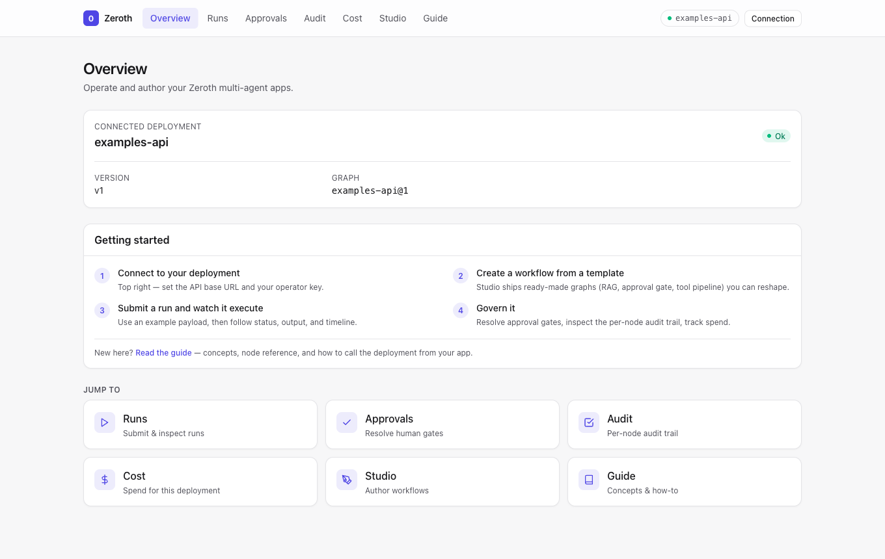
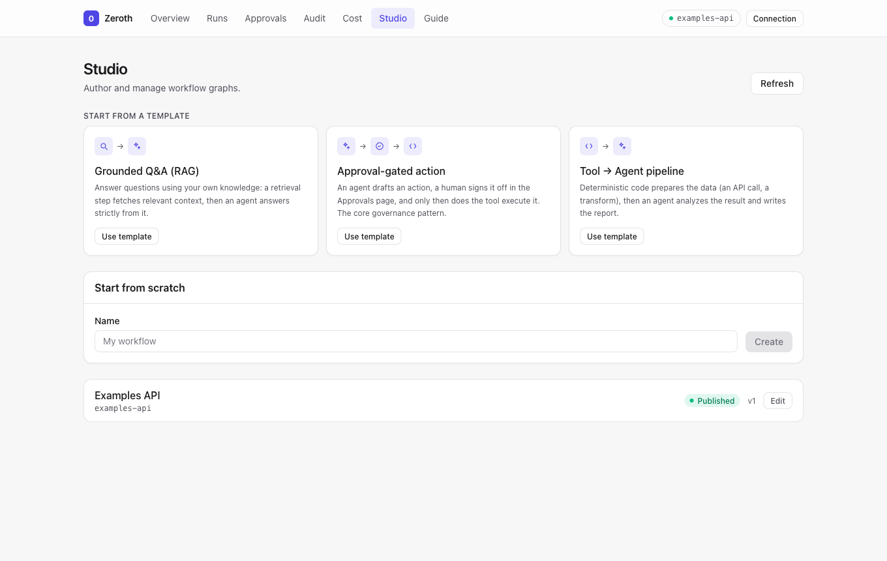
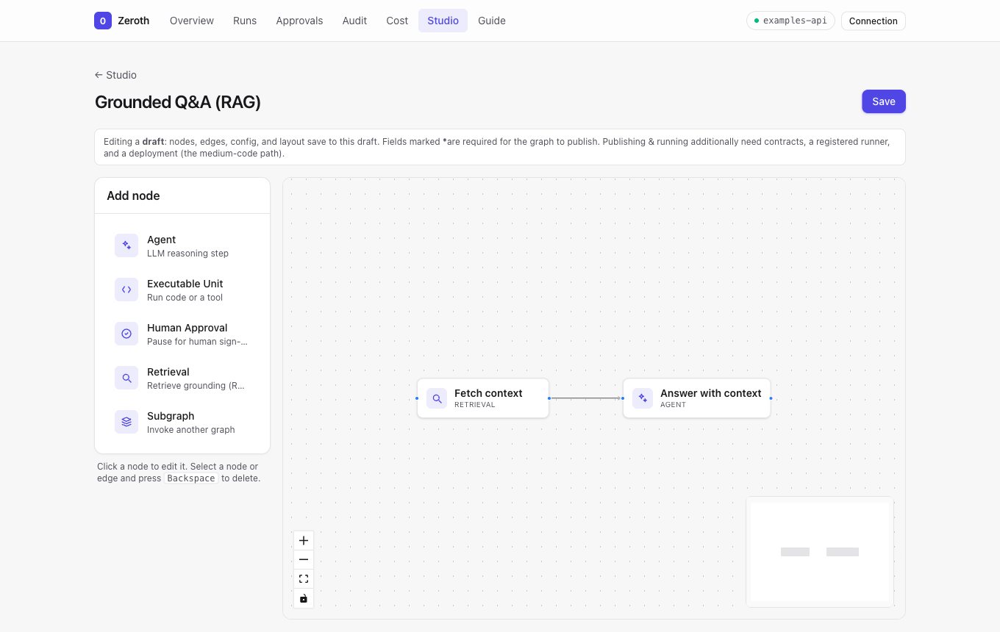
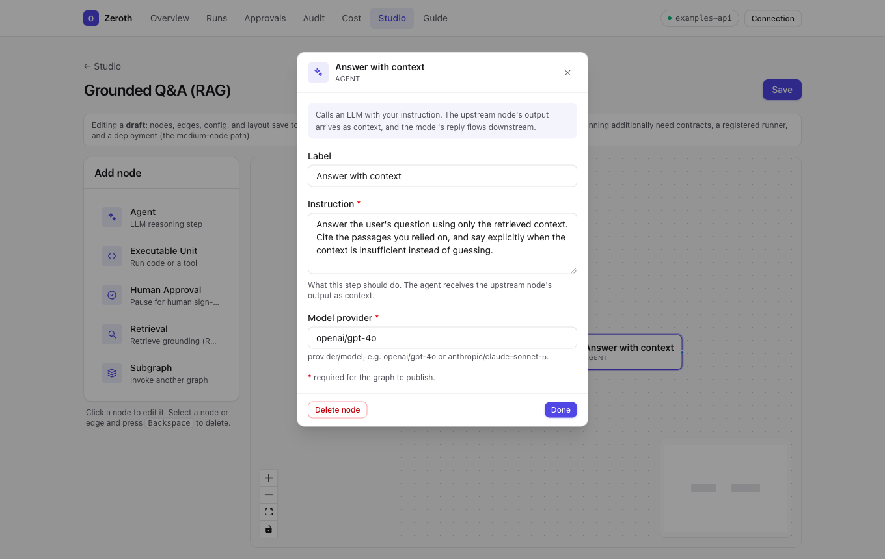

# Zeroth

A governed medium-code platform for building, running, and deploying production-grade multi-agent systems as standalone API services.

Zeroth treats an agentic application as an **explicit executable graph** rather than an opaque prompt chain. Every node boundary is typed, every executable unit runs inside a governed sandbox, memory is attachable and shareable, and audits are recorded per node. The result is a system you can reason about, govern, and deploy with confidence.

---

## Documentation

Full documentation lives at **<https://rrrozhd.github.io/zeroth-core/>** —
start with the [Getting Started tutorial](https://rrrozhd.github.io/zeroth-core/tutorials/getting-started/)
or the [Governance Walkthrough](https://rrrozhd.github.io/zeroth-core/tutorials/governance-walkthrough/).

---

## Quickstart

One command clones the repo, installs everything, and serves a working demo
deployment — a deployed Q&A graph on `http://127.0.0.1:8000` with the web
console at `/console/`:

```bash
curl -fsSL https://raw.githubusercontent.com/rrrozhd/zeroth-core/main/scripts/quickstart.sh | bash
```

(Prefer to read before you run? `curl -fsSLO …/quickstart.sh`, inspect it, then
`bash quickstart.sh`. From an existing checkout just run `./scripts/quickstart.sh`.)

The script installs [uv](https://docs.astral.sh/uv/) if missing, provisions
Python 3.12, builds the web console when Node 20+ is available, prompts for an
`OPENAI_API_KEY` (optional — without one you can still explore the console and
Studio), and starts the service. Open **<http://127.0.0.1:8000/console/>** and
connect with the demo key `demo-operator-key` — the console's Guide page and
workflow templates take it from there.

---

## Install

```bash
pip install zeroth-core
```

Optional extras pull in swappable backends (base install stays minimal):

```bash
pip install "zeroth-core[memory-pg]"     # Postgres + pgvector memory backend
pip install "zeroth-core[memory-chroma]" # Chroma memory backend
pip install "zeroth-core[memory-es]"     # Elasticsearch memory backend
pip install "zeroth-core[dispatch]"      # Distributed worker (redis + arq)
pip install "zeroth-core[sandbox]"       # Sandbox sidecar marker
pip install "zeroth-core[all]"           # Everything above
```

Available extras: `memory-pg`, `memory-chroma`, `memory-es`, `dispatch`, `sandbox`, `all`.

---

## Why Zeroth?

Most agent frameworks prioritize getting something working quickly. Zeroth prioritizes getting something **working correctly** — with governance, auditability, and operational control built in from day one.

| What Zeroth **is** | What Zeroth **is not** |
|---|---|
| A medium-code platform for governed agentic backends | A generic no-code automation tool |
| A graph-based runtime for typed multi-agent systems | A chat UI builder |
| A controlled execution platform for code-backed workflows | A prompt playground |
| A deployment environment that ships workflows as API services | An ungoverned autonomous agent sandbox |

---

## Key Concepts

### Graphs

A **graph** is your application. It defines how agents, executable units, and approval steps connect and interact. Graphs can be cyclic, support branching conditions, and are executed asynchronously.

### Three Node Types

Zeroth keeps its primitives minimal. Every graph is composed from just three node types:

- **Agent** — an AI-powered node backed by an LLM provider, with optional tool attachments and memory connectors
- **Executable Unit** — a sandboxed unit of work (Python code, shell scripts, commands, or full projects) that handles transformations, integrations, routing, and any deterministic processing
- **Human Approval** — a pause point where a human must review and approve before execution continues

### Contracts

Node inputs and outputs are defined by **contracts** — Pydantic-based schemas that are validated at every node boundary. This means type errors are caught at the edge between nodes, not buried deep inside a run.

### Memory

Agents can optionally attach **memory connectors** for persistent state. Multiple agents can share the same connector instance (and therefore share memory), or each agent can have its own. Memory types include key-value, thread-scoped, and run-ephemeral stores.

### Threads and Runs

A **run** is a single execution of a graph. A **thread** groups related runs together for conversation continuity. Stateful agents resume their context across runs through a stable `thread_id`, so agents can maintain long-running conversations without treating every invocation as stateless.

### Governance

Zeroth enforces governance at multiple layers:

- **Policy** — capability-based rules controlling what agents can do (network access, file writes, memory access, secret usage)
- **Guardrails** — rate limiting, quota enforcement, and dead-letter queues for failed operations
- **Audit** — per-node event tracking with secret redaction, timeline assembly, and evidence summaries
- **Approvals** — human-in-the-loop gates with decision tracking
- **Secrets** — resolved from secure providers and automatically redacted from logs

### v4.0 Platform Extensions

Zeroth v4.0 adds six subsystems for production agentic workflows:

- **Resilient HTTP Client** — Platform-provided async HTTP with retry, circuit breaking, and connection pooling for external API calls
- **Prompt Templates** — Versioned prompt template registry with Jinja2 sandboxed rendering and automatic secret redaction in audit records
- **Context Window Management** — Per-agent token tracking with automatic compaction (truncation, observation masking, or LLM summarization) when thresholds are reached
- **Parallel Fan-Out/Fan-In** — Spawn N concurrent branches from a node's output with isolated execution contexts, deterministic merge, and per-branch cost attribution
- **Subgraph Composition** — Reference published graphs as nested nodes with inherited governance, configurable thread sharing, and approval propagation
- **Artifact Store** — Externalize large binary outputs from nodes; retrieve via `GET /v1/artifacts/{id}`

REST endpoints for artifact retrieval (`GET /v1/artifacts/{id}`) and template management (`GET/POST/DELETE /v1/templates`) are available under `/v1/`.

---

## Architecture Overview

```
┌──────────────────────────────────────────────────────┐
│                    Service Layer                      │
│              (FastAPI async API wrapper)              │
├──────────────────────────────────────────────────────┤
│                    Orchestrator                       │
│      (graph traversal, node dispatch, branching)     │
├────────────┬────────────┬────────────┬───────────────┤
│   Agent    │ Executable │   Human    │  Conditions   │
│  Runtime   │   Units    │ Approvals  │  & Branching  │
├────────────┴────────────┴────────────┴───────────────┤
│  Contracts │  Mappings  │  Memory    │    Policy     │
├────────────┬────────────┬────────────┬───────────────┤
│  Parallel  │  Subgraph  │ Templates  │   Artifacts   │
│  Execution │ Composition│            │               │
├────────────┴────────────┼────────────┴───────────────┤
│  Context Window Mgmt    │  Resilient HTTP Client     │
├──────────────────────────────────────────────────────┤
│  Audit  │  Guardrails  │  Secrets  │  Observability │
├──────────────────────────────────────────────────────┤
│  Storage (SQLite + Redis)  │  Identity & Auth        │
└──────────────────────────────────────────────────────┘
```

Zeroth is implemented as a **modular monolith** — all subsystems live in a single deployable unit but are cleanly separated by domain.

---

## Getting Started

### Prerequisites

- **Python 3.12+**
- **[uv](https://docs.astral.sh/uv/)** — fast Python package manager
- **Docker** (for sandboxed executable unit execution)
- **Redis** (for distributed runtime state; optional for local development)

### Installation

```bash
# Clone the repository
git clone https://github.com/rrrozhd/zeroth-core.git
cd zeroth-core

# Install dependencies
uv sync

# Verify installation
uv run python -c "import zeroth; print('Zeroth is ready')"
```

### Running Tests

```bash
# Run the full test suite
uv run pytest -v

# Run tests for a specific module
uv run pytest tests/graph/ -v
uv run pytest tests/contracts/ -v
```

### Linting and Formatting

```bash
# Check for lint errors
uv run ruff check src/

# Auto-format code
uv run ruff format src/
```

---

## Project Structure

```
src/zeroth/
├── agent_runtime/      # Agent execution, LLM providers, tool attachments
├── approvals/          # Human approval workflows and decision tracking
├── artifacts/          # Artifact externalization and retrieval
├── audit/              # Per-node event tracking, redaction, evidence
├── conditions/         # Branch evaluation and traversal logging
├── context_window/     # Token tracking and context compaction
├── contracts/          # Pydantic-based schema registration and versioning
├── deployments/        # Immutable graph snapshots and version management
├── dispatch/           # Durable run dispatch and worker supervision
├── execution_units/    # Sandboxed code execution (Docker, Python, shell)
├── graph/              # Workflow DAG structure and persistence
├── guardrails/         # Rate limiting, quotas, dead-letter queues
├── http/               # Resilient async HTTP client (http_client) with retry and circuit breaking
├── identity/           # Authentication, principals, roles, scoping
├── mappings/           # Data flow definitions between graph nodes
├── memory/             # Persistent agent memory connectors
├── observability/      # Metrics, correlation IDs, structured logging
├── orchestrator/       # Core workflow execution engine
├── parallel/           # Fan-out/fan-in concurrent branch execution
├── policy/             # Capability-based access control
├── runs/               # Run and thread state persistence
├── secrets/            # Secret resolution and redaction
├── service/            # FastAPI HTTP API and bootstrap
├── storage/            # SQLite, Redis, migrations, encryption
├── subgraph/           # Nested graph composition and resolution
└── templates/          # Versioned prompt template registry
```

---

## Executable Unit Modes

Zeroth supports three ways to define executable units:

| Mode | Description | Use Case |
|---|---|---|
| **Native Unit** | Code written directly in the platform | Quick transformations, lightweight logic |
| **Wrapped Command** | Existing script, binary, or command with a manifest | Integrating existing tools without rewriting them |
| **Project Unit** | Uploaded project/archive with build + run manifest | Complex workloads with dependencies |

All executable units run inside sandboxed environments with resource constraints, cached environment reuse, and integrity verification.

---

## Design Principles

Zeroth optimizes for:

- **Explicitness over hidden magic** — every connection, mapping, and policy is visible and inspectable
- **Governance over permissive flexibility** — agents operate within declared capabilities
- **Manageability over novelty** — production operations come first
- **Compatibility with existing code** — wrap what you have, don't rewrite it
- **Auditability over opaque orchestration** — per-node audit trails, not monolithic logs
- **Explicit state persistence over hidden in-memory behavior** — thread-based continuity you can inspect and reason about

---

## Web Console

An in-repo web console (`frontend/`) for operating and authoring Zeroth apps —
a Next.js **static export** that talks to the platform's HTTP API.

| | |
|---|---|
|  |  |
|  |  |

**Start from a template, not a blank canvas.** Studio ships ready-made example
graphs — *Grounded Q&A (RAG)*, *Approval-gated action*, *Tool → Agent
pipeline* — that instantiate as fully editable drafts in one click. Every node
config field carries a hint and example value, each node type explains itself
in the editor, and the built-in **Guide** page covers concepts, the
zero-to-run walkthrough, a node type reference, and an API quickstart. Empty
states across Runs, Approvals, and Audit explain how each view gets populated.

The console is built once and runs in **two modes from the same bundle**:

- **Mounted** — when a build is present, the FastAPI app serves it at
  `/console` on the same origin as the API. One deployment ships both API and
  UI; no CORS, no second host.
- **Standalone** — host the static bundle anywhere and point it at a remote
  API. Set the API base URL + key in the console's *Connect* bar; enable CORS
  on the API (below).

The console reads its API base URL and `X-API-Key` from the browser at runtime
(localStorage), so the same artifact works in both modes.

**What it covers:** an overview/health dashboard with a getting-started
checklist; runs (submit with example payloads + a live-polling detail view);
approvals (approve/reject); per-node audit; deployment cost; a Studio with
workflow templates, CRUD, and a React Flow graph canvas; and an in-console
Guide.

> **Studio authoring edits draft graph structure.** On a *draft* you can add the
> five executable node types (agent, executable_unit, human_approval, retrieval,
> subgraph), edit each node's config, draw edges, and save real graph nodes/edges
> plus layout. Published graphs are read-only — *clone to a draft* to edit. Note:
> an authored draft still needs contracts + a registered runner + deployment to
> actually run; the canvas authors graph *structure*, not the full medium-code
> wiring.

```bash
# Build the static export (requires Node; produces frontend/out/)
cd frontend && npm install && npm run build

# Mounted: any Zeroth service auto-mounts frontend/out at /console.
# Override the location with ZEROTH_CONSOLE_DIR=/path/to/out
# Then open http://<host>/console/

# Standalone dev against a running API on :8000
npm run dev                       # serves http://localhost:3000/console/
# ...and allow that origin on the API:
export ZEROTH_CONSOLE_CORS_ORIGINS="http://localhost:3000"
```

| Env var | Purpose |
| ------- | ------- |
| `ZEROTH_CONSOLE_DIR` | Explicit path to the built `out/` dir (defaults to `frontend/out`). |
| `ZEROTH_CONSOLE_CORS_ORIGINS` | Comma-separated origins allowed to call the API cross-origin (standalone mode). Unset = no CORS (mounted mode). |

If no build is present (Python-only install / CI with no Node), the mount is
skipped silently and the API is unaffected. See [frontend/README.md](frontend/README.md)
for development details.

---

## License

See the [LICENSE](LICENSE) file for details.
