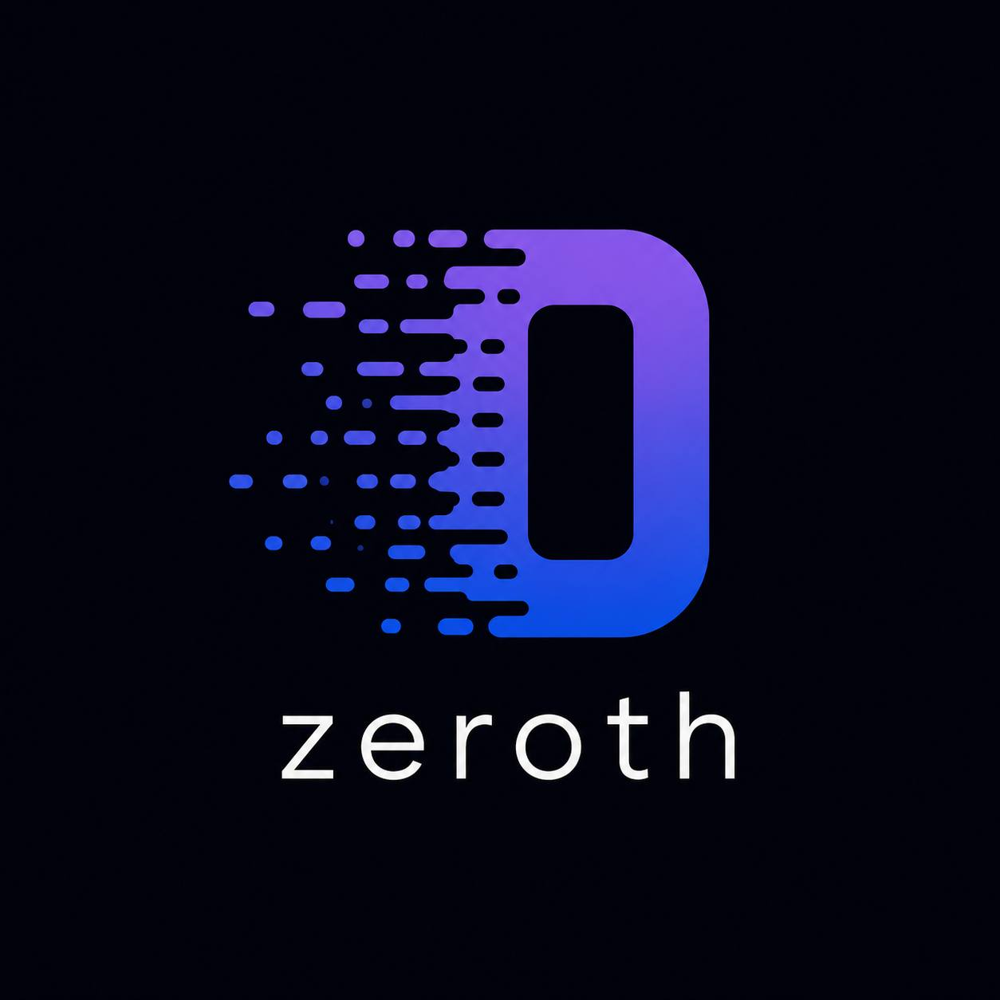

<p align="center">
  <picture>
    <source media="(prefers-color-scheme: dark)" srcset="docs/assets/logo/zeroth-lockup-v2.png">
    
  </picture>
</p>

<p align="center">
  <a href="https://github.com/rrrozhd/zeroth/actions/workflows/docs.yml?query=branch%3Amain"></a>
  <a href="https://github.com/rrrozhd/zeroth/actions/workflows/ci.yml?query=branch%3Amain"></a>
</p>

[Documentation](https://rrrozhd.github.io/zeroth/) ·
[SDK on PyPI](https://pypi.org/project/zeroth-sdk/0.1.0a1/) ·
[Changelog](CHANGELOG.md) · [License](LICENSE)

Zeroth is an open-source platform for running AI workflows, controlling what
they can do, and evaluating changes to their cost and outcomes. Use its Python
runtime to build applications, its HTTP APIs to operate them, or its adapters
to add governance and evidence collection to an existing workflow.

## What it does

- **Orchestration:** execute graphs of agents, tools, code, retrieval, and human
  approvals, with branching, bounded loops, parallel work, checkpoints, and
  resumable runs.
- **Governance:** apply capability policies, pause for approval before protected
  actions, enforce configured budgets, and retain per-node audit records.
- **Contracts and integrations:** validate data at node boundaries; connect
  memory stores, HTTP services, MCP tools, executable units, and LangGraph apps.
- **Economic analysis:** connect execution evidence to workflow versions,
  attempts, and outcomes; inspect measured cost per accepted outcome, explain
  expensive or failing cohorts, and reconcile telemetry with provider bills.
- **Evaluation and change decisions:** run evaluations and bounded model-swap
  backtests. The experimental model-migration API adds risk estimates, retained
  recommendations, rollout verification, and PDF decision reports.

The console is an optional interface to these APIs. Execution, policy checks,
and economic decisions happen in the backend.

## Packages and availability

These are separate Python distributions, not different names for the same install.

| Package | What it installs | Availability |
|---|---|---|
| `zeroth-sdk` | Remote client, wire contracts, and instrumentation namespace | `0.1.0a1` on PyPI; experimental prerelease |
| `zeroth-platform` | Self-hosted runtime, governance, APIs, and economic modules | Source checkout; PyPI release pending |
| `zeroth-console` | Optional static web console | Build from `frontend/`; current companion release pending |
| `zeroth-core` | Compatibility package pointing to the matching platform version | Compatibility release pending; old PyPI `0.1.0` is not this platform |

The SDK is a small client with two direct dependencies: `httpx` and `pydantic`.
It does not install the server, database layer, forecasting engine, or UI.
The platform has a larger dependency set because it runs those workloads;
optional integrations are selected through extras.

Zeroth Cloud, the proposed managed service, is **not yet available**. Installing
the SDK does not create an account or provide a hosted endpoint. The published
SDK works with your own compatible Zeroth deployment. Its API may change before
a stable release.

## Quickstart

### Connect to a deployment with Python

Requires Python 3.12+:

```bash
python -m pip install "zeroth-sdk==0.1.0a1"
```

Set `ZEROTH_API_KEY` to a project API key and `ZEROTH_BASE_URL` to your
deployment's economic API base URL. A separately served economic API might use
`http://127.0.0.1:8001`; when mounted by the platform, its path is `/regulus`.
Do not use the console's demo operator key as a project API key.

```python
import os

from zeroth.protocol import ExecutionEvent
from zeroth.sdk import ZerothClient

client = ZerothClient(
    api_key=os.environ["ZEROTH_API_KEY"],
    base_url=os.environ["ZEROTH_BASE_URL"],
)
try:
    client.record_execution(
        ExecutionEvent(
            workflow="invoice-processing",
            workflow_version="v7",
            run_id="run-1",
            step="extract",
            cost_usd="0.031",
        )
    )
finally:
    client.close()
```

This records one measured execution; outcome evidence must be supplied separately
before it can support an economic comparison. See the
[SDK guide](packaging/sdk/README.md) for outcomes, backtests, and decisions.
Releases are built and verified through the
[SDK release workflow](https://github.com/rrrozhd/zeroth/actions/workflows/release-zeroth-sdk.yml).

### Run the platform locally

Use a source checkout matching the documentation you are reading. From its root,
with Python 3.12+ and [uv](https://docs.astral.sh/uv/) installed:

```bash
uv sync --extra regulus
uv run zeroth seed-demo
```

The seed command creates a demo deployment and prints the environment exports
and API request for your first run. Apply those exports, then start the service:

```bash
uv run zeroth serve
```

The service defaults to port 8000 and exposes its API explorer at `/docs`.
This is a local demo setup, not a production deployment recipe. An LLM provider
key is needed to execute the demo's model calls; a web console is not required.

For a guided path, start with [installation](docs/tutorials/getting-started/01-install.md),
then [your first graph](docs/tutorials/getting-started/02-first-graph.md) and
[service mode and approvals](docs/tutorials/getting-started/03-service-and-approval.md).
To run the economic API separately, use the
[debugger setup guide](docs/how-to/economic-debugger.md).

For a container, build the candidate wheel before building the image:

```bash
uv build --wheel
docker build -t zeroth-platform .
```

See the [deployment guide](docs/how-to/deployment/langgraph-release.md) for
configuration, migrations, and readiness checks before running the image.

## Runtime and governance

A graph defines the application's steps and connections. Each node has input
and output contracts. A run records one execution; a thread carries context
across related runs. The runtime persists progress so approvals, nested
subgraphs, parallel branches, and bounded loops can resume from checkpoints.
The [node catalog](docs/concepts/graph.md#node-types) describes all supported node
types and their execution boundaries.

Executable units can wrap code, commands, or projects. Memory connectors,
versioned prompt templates, context compaction, and an artifact store support
longer-running applications. See [graph concepts](docs/concepts/graph.md),
[executable units](docs/concepts/execution-units.md), and
[memory](docs/concepts/memory.md).

### Governance

Policy and approval checks run before protected execution, not in the console.
Important deployment boundaries:

- Capability enforcement governs declared tool and memory access. For untrusted
  executable code, use the Docker or sidecar sandbox; the local subprocess
  backend is not a filesystem or network isolation boundary.
- Tenant budget enforcement needs the `regulus` extra for the bundled backend,
  or a reachable external control plane. A bare install with the plane enabled
  but no backend denies admission. The budget check fails closed by default;
  `ZEROTH_REGULUS__FAIL_CLOSED=false` is a development escape hatch and
  production rejects it. Spend-to-date checks can overshoot within one call;
  they are not an atomic reservation of future spend.
- Use durable signing secrets and the documented database/migration setup for
  persistent or multi-worker deployments. Ephemeral demo identities are not a
  production configuration.

Gateway-only mode cannot enforce internal Agent Server tool calls. For LangGraph
tool-body allow, deny, and approval checks, install the in-process adapter and
use `govern_tools` or `ZerothMiddleware`. Gateway admission and tracing have a
different enforcement boundary.

See the [governance walkthrough](docs/tutorials/governance-walkthrough.md),
[LangGraph deployment guide](docs/how-to/deployment/langgraph-release.md), and
[security policy](SECURITY.md).

## Economic analysis and model-change experiments

The economic layer records versioned cost and outcome evidence, keeps measured
and estimated amounts distinct, and reports missing evidence instead of treating
it as zero. Success definitions are immutable per workflow version. Provider-bill
reconciliation keeps billed totals, measured costs, variance, and unmatched
amounts separate.

The experimental model-migration loop asks whether a workload should move from
an incumbent model to a candidate:

1. Collect paired case evidence and forecast-versus-observed calibration history.
2. Simulate cost, quality, latency, and critical-error outcomes under candidate
   routing choices using Monte Carlo resampling.
3. Check constraint-breach probabilities and tail-loss limits (CVaR), then return
   an inspectable recommendation or a request for more evidence.
4. Retain the decision, optionally generate a PDF, and verify a randomized rollout
   before adding observations to later calibration checks.

These are advisory experiments, not automatic traffic changes or guaranteed
savings. More simulations do not compensate for too little real evidence.
Calibration, drift, and evidence gates may abstain. Causal verification requires
retained randomized assignments and uncontaminated observations; an ordinary
before/after comparison is not a causal result.

Decision schedules and explicit, configured SMTP report delivery are implemented.
Automatic scheduled report emails and general optimization of prompts, retries,
capacity, and delivery time are not. The proposed Cloud service would operate
this decision loop continuously; that roadmap is separate from what is installable
and self-hostable today.

See [economic debugging](docs/how-to/economic-debugger.md),
[provider-bill reconciliation](docs/how-to/provider-bill-reconciliation.md), and
the [SDK decision API](packaging/sdk/README.md).

## Optional integrations

From a source checkout, select what your deployment needs:

```bash
uv sync --extra regulus           # Economic API, analytics, and reports
uv sync --extra langgraph         # In-process LangGraph governance
uv sync --extra langgraph-gateway  # Agent Server gateway transport
uv sync --extra memory-pg         # pgvector memory support
uv sync --extra memory-chroma     # Chroma memory support
uv sync --extra memory-es         # Elasticsearch memory support
uv sync --extra dispatch          # Distributed workers
uv sync --extra otel              # OpenTelemetry export
```

Combine extras in one command to retain multiple integrations. `all` selects
the headless runtime bundle; it excludes the console, in-process LangGraph
adapter, and hosted identity/billing adapters. The `cloud` extra supplies those
vendor adapters, not a running managed service. See [pyproject.toml](pyproject.toml)
for the complete dependency groups.

## Project structure

```text
src/zeroth/
├── contracts/      # Graphs, schemas, conditions, mappings, and registries
├── runtime/        # Agents, orchestration, runs, parallelism, and subgraphs
├── governance/     # Policies, approvals, audit, identity, and retention
├── econ/           # Evidence, analytics, simulation, and economic API
├── integrations/   # Execution, memory, HTTP, MCP, and LangGraph adapters
├── platform/       # Configuration, storage, artifacts, secrets, and dispatch
├── eval/           # Datasets, scoring, evaluation runners, and CI gates
├── service/        # CLI, FastAPI service, APIs, and deployment bootstrap
└── core/           # Legacy import compatibility
packaging/sdk/      # Lightweight remote client distribution
packaging/core-compat/ # Exact-version zeroth-core compatibility package
packaging/console/  # Optional static console distribution
frontend/           # Console source
docs/               # Guides and API reference
tests/              # Runtime, API, isolation, and release-contract tests
```

Distribution names and Python imports are separate: the platform and SDK share
the `zeroth.*` namespace. New code should use the canonical domain imports; see
the [import migration map](docs/backend-import-migration.md). The primary CLI
is `zeroth`; `zeroth-core` remains a compatibility alias.

## Web Console

The optional Next.js console supports graph authoring, runs, approvals, audit,
and economic inspection. It can be mounted at `/console` or served separately
against the API. Creating a deployment version still requires a service restart
before that version is served.

Build it from [frontend/](frontend/README.md) while the current companion package
release is pending. Without console assets, the API continues to work. See
[local development](docs/how-to/deployment/local-dev.md) and
[pilot operations](docs/operations/pilot-operations.md) for deployment details.

## Development

```bash
uv sync --extra regulus
uv run pytest -q
uv run ruff check src/
```

For API and module details, use the [documentation](https://rrrozhd.github.io/zeroth/).
Report bugs through [GitHub issues](https://github.com/rrrozhd/zeroth/issues);
report vulnerabilities through [SECURITY.md](SECURITY.md).

## License

Zeroth is licensed under [Apache 2.0](LICENSE).
