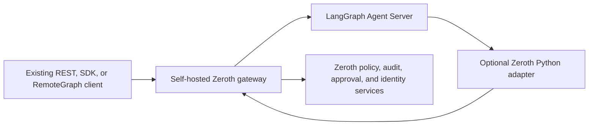

# LangGraph Deployment Governance — L1 Design

**Status:** Approved design, pending implementation planning  
**Date:** 2026-07-22  
**Product priority:** Highest-conversion portability wedge  

## Summary

Zeroth will govern already-deployed Python LangGraph applications without requiring graph migration. The first release, L1, places a self-hosted Zeroth gateway in front of a LangGraph Agent Server and optionally installs a small Python adapter inside the LangGraph deployment.

The gateway preserves the Agent Server API. A customer changes the Agent Server base URL and credentials, not the graph. Gateway-only installations receive principal-aware run admission, request/run audit, budget controls, and visibility into existing interrupts. Applications that add the Python adapter also receive causal per-node tracing, tool-level allow/deny decisions, and tool approvals backed by LangGraph's native `interrupt()` and checkpoint/resume behavior.

The product must state the enforcement boundary precisely. A gateway cannot block an internal tool call it never observes. Tool enforcement therefore requires an in-process hook. Documentation, the API, and the console must report the active governance level rather than using a single undifferentiated "governed" label.

L2 interoperation and L3 transpilation remain later, separate deliverables. L1 will create extension points and a differential harness that they can reuse, but it will not absorb migration work.

## Goals

1. Put Zeroth in front of an existing Agent Server deployment without changing the graph or replacing LangGraph clients.
2. Preserve the behavior of REST, SDK, `RemoteGraph`, streaming, thread state, interrupts, and resume operations within the documented L1 version and endpoint inventory.
3. Enforce principal-, tenant-, assistant-, deployment-, budget-, and input-level policy before a run is admitted.
4. Add causal node, LLM, and tool audit with a minimal Python deployment change.
5. Enforce tool allow, deny, and require-approval decisions before side effects occur.
6. Route Zeroth approval decisions through LangGraph's checkpoint and `Command(resume=...)` semantics rather than introducing a second execution-state owner.
7. Emit OpenTelemetry GenAI telemetry as the canonical interchange format.
8. Prove transparent behavior with a direct-versus-governed differential harness.

## Non-goals

- Porting a LangGraph graph into Zeroth's native graph model.
- Transpiling topology, state schemas, reducers, routers, or node bodies.
- Replacing LangGraph checkpointers, threads, or time-travel semantics.
- Tool-level enforcement in gateway-only mode.
- Retrofitting tool interception into arbitrary Python hidden inside an already compiled graph.
- JavaScript/TypeScript in-process adapters in L1. The gateway protocol remains language-neutral so this can be added later.
- Creating a Zeroth-specific tracing wire format.
- Treating arbitrary existing LangGraph interrupts as Zeroth approval requests without an explicit mapping.

## Product modes and capability reporting

The integration exposes three cumulative capability levels:

| Level | Installed surface | Guaranteed capabilities |
|---|---|---|
| `admission` | Gateway only | Authentication, principal resolution, run admission, budget/rate controls, request/run audit, streaming-preserving proxy, existing interrupt visibility |
| `observed` | Gateway + governed graph callback adapter | All admission capabilities plus per-node/LLM/tool causal audit and OTel export |
| `enforced` | Gateway + `govern_graph` + complete governed-tool boundary | All observed capabilities plus tool allow/deny and adapter-defined approval interrupts |

The gateway publishes the active level per deployment. The console, audit records, health endpoint, CLI output, and documentation use these exact levels. A missing or unhealthy adapter causes the reported level to fall back; it never silently claims `enforced`.

Capability claims are authoritative per run and conservative per deployment:

- `govern_graph` emits a signed run-start attestation identifying the graph version and installed callback hooks.
- Governed tool surfaces register a manifest containing the graph/deployment version, adapter version, wrapped tool names and fingerprints, and `partial` or `complete` coverage.
- `create_agent` middleware may declare `complete` coverage for the exact tool inventory passed to that agent. `govern_tools` defaults to `partial`; declaring it complete requires an explicit expected-tool inventory whose fingerprints match at startup.
- `enforced` means the current run presented a valid, fresh attestation for a complete tool inventory. A partial inventory is reported as `observed` with a separate list of enforced tools; it is never promoted to deployment-wide enforcement.
- Adapter instances heartbeat every 30 seconds by default. A run attestation is fresh for that run, while the deployment dashboard is labeled "last known" and downgrades after 90 seconds without a heartbeat. Both intervals are configurable, but the stale threshold must exceed two heartbeat intervals.
- If no run-start attestation arrives, the run is reported as `admission` even when the deployment was previously healthy.

The gateway does not attempt to prove that arbitrary Python contains no hidden tool calls. Only an exact, adapter-registered inventory can produce `enforced`.

Gateway-only mode can observe and forward existing LangGraph interrupts. An arbitrary interrupt remains application-owned because its resume payload may have custom semantics. Full Zeroth approval creation and automatic resume are guaranteed only for the structured interrupt schema emitted by the enhanced adapter, or for an explicitly configured custom mapping.

## Architecture



### Zeroth gateway

The gateway is a deployment mode of Zeroth's existing modular service, not a separate product or service architecture. It is configured with an upstream Agent Server URL, an upstream credential reference when Zeroth must resume a run asynchronously, a deployment identity, and governance bindings.

It contains four bounded components:

1. **Agent Server proxy.** Transparently forwards supported Agent Server endpoints, including assistants, threads, runs, state, cancellation, streaming, and resume. It preserves upstream status codes, payloads, and stream framing.
2. **Identity bridge.** Resolves the Zeroth principal and tenant, removes spoofable integration context, and injects a signed replacement into forwarded run configuration.
3. **Governance admission.** Evaluates policy and budget controls before a run-creating request reaches the upstream server.
4. **Correlation and approval bridge.** Joins gateway requests, upstream run/thread/assistant IDs, adapter events, policy decisions, and approvals. It can resume adapter-defined approvals through the upstream Agent Server using a configured service credential.

The proxy must be implemented as streaming HTTP forwarding, not as an invocation wrapper that buffers a graph response. It propagates cancellation, backpressure, timeouts, and client disconnects upstream.

### Python adapter

The adapter lives under one public LangGraph integration namespace and evolves the existing whole-graph LangGraph instrumentation rather than adding a competing integration. It supports three explicit installation surfaces:

```python
# Arbitrary compiled StateGraph: callback audit and context propagation.
graph = govern_graph(graph)

# Raw tool lists used by StateGraph or ToolNode: tool enforcement.
tools = govern_tools(tools)

# create_agent applications: native wrap_tool_call enforcement plus graph audit.
agent = govern_graph(
    create_agent(..., middleware=[ZerothMiddleware()])
)
```

`govern_graph` delegates `invoke`, `ainvoke`, `stream`, and `astream`, merges the Zeroth callback handler into the runtime configuration, preserves user callbacks, and delegates unsupported attributes to the wrapped graph.

`govern_tools` returns governed wrappers without mutating the original tool or its `.func`. `ZerothMiddleware` uses the supported `wrap_tool_call` call path for applications built with `create_agent`. Both tool surfaces share the same decision client, exception types, interrupt schema, redaction, and audit behavior.

`enforced` is cumulative and requires both surfaces: `govern_graph` must emit the valid run-start observation attestation, and `govern_tools` or `ZerothMiddleware` must register a matching complete tool inventory. `ZerothMiddleware` alone controls its tool path but cannot claim `enforced` because it does not provide the full callback tree or run attestation. If only `govern_graph` is installed, the level is `observed`. The adapter must not infer control of tool calls from callback visibility.

### Existing Zeroth seams

Implementation should reuse these existing capabilities:

- `PolicyGuard` and policy/capability registries for decisions.
- `ToolContractBinding` metadata for side effects, required capabilities, approval requirements, timeouts, and tags.
- Existing approvals, audit repositories, signed provenance, identity, tenant isolation, and retention controls.
- The current LangGraph whole-graph telemetry wrapper as the compatibility seam to refactor.
- Existing orchestrator concepts for approval records, without routing LangGraph execution through the Zeroth orchestrator.

LangGraph remains the execution runtime for L1.

## Request and execution flow

1. An existing client calls the Zeroth gateway using an Agent Server-compatible URL.
2. The gateway authenticates the request and resolves tenant, principal, roles, and deployment.
3. The gateway removes any client-provided reserved Zeroth integration fields.
4. Admission policy evaluates the assistant, input classification, principal, tenant, deployment, and budget. A deny response is returned before the upstream creates a run.
5. For allowed requests, the gateway injects a short-lived signed context containing tenant, principal, roles, correlation ID, deployment, policy version, expiry, and intended audience.
6. The Agent Server executes the existing graph. In gateway-only mode, no internal hooks are assumed.
7. In observed/enforced mode, callback events create causally linked spans using callback `run_id` and `parent_run_id`, correlated to the gateway request by the signed context.
8. Before a governed tool executes, the adapter sends its normalized action descriptor and signed context to the gateway decision endpoint. Raw sensitive values follow capture/redaction policy.
9. `allow` executes the tool. `deny` raises a typed `PolicyViolation` before the tool body. For `require_approval`, the idempotent decision response contains an approval ID and action key, and the gateway creates an approval in `awaiting_checkpoint` state.
10. The adapter immediately invokes LangGraph `interrupt()` with that approval ID before the tool body. Repeating the decision request after node restart returns the same approval ID.
11. The gateway confirms that the upstream run reached the matching interrupt through the active response/stream or a detached-run reconciler, then marks the approval `ready`. A reviewer may decide earlier, but automatic resume waits for `ready`.
12. A reviewer approves, edits where policy permits, or rejects through Zeroth's existing approval surface.
13. The gateway resumes the same upstream thread with `Command(resume=...)`. The adapter validates the resolution and revalidates policy before executing an approved action.
14. Callback and policy events finalize the trace and project relevant governance facts into Zeroth's existing audit/provenance storage.

## Principal and trust context

The reserved `_zeroth` context is a signed envelope, not trusted client metadata. Its claims include:

- tenant and principal identifiers;
- roles or resolved authorization context;
- deployment and upstream audience;
- request correlation identifier;
- policy bundle/version identifier;
- issued-at and expiry timestamps;
- optional content-capture classification.

The gateway always strips a client-supplied reserved field before injecting its own. The adapter rejects invalid signatures, incorrect audiences, expired envelopes, and deployment mismatches. Adapter-to-gateway requests use a deployment-scoped credential; production deployments may additionally require mTLS.

The gateway must not copy Python callback objects or other unserializable values through the public Agent Server API. All cross-process context is JSON-serializable and signed.

## Policy and outage semantics

Run admission is synchronous. A policy or budget deny prevents upstream run creation.

Tool decisions are also synchronous because they sit before side effects. Default failure behavior is:

- side-effecting or unknown-classification tools fail closed when no valid decision can be obtained;
- read-only tools may use an explicitly enabled, short-lived, signed policy cache;
- no outage path converts deny or require-approval into allow;
- adapter capability health is reported to the gateway and reflected in the active governance level.

Audit delivery uses a bounded local queue with durable retry where available. Audit backpressure cannot reorder or buffer user-visible token streams. Enforcement records are idempotent, and queue exhaustion is observable through health and metrics.

## Approval semantics

LangGraph restarts an interrupted node from its beginning when execution resumes. The adapter therefore performs no non-idempotent side effect before `interrupt()`.

The adapter's interrupt payload is versioned and JSON-serializable. It includes the integration schema version, tool name, redacted/captured arguments as allowed, tool-call identity when available, policy decision reference, correlation context, allowed review actions, and a human-readable reason. The adapter does not create approval storage directly; the idempotent gateway decision call creates the `awaiting_checkpoint` record before the adapter interrupts.

The decision request has an idempotency key built from deployment, thread, graph task/checkpoint identity, tool-call ID when available, and a canonical action hash. The gateway creates the approval intent as part of that idempotent decision. If the adapter cannot obtain a stable task/tool identity, approval-required execution fails closed with an integration error rather than risk duplicate approvals or side effects.

The approval begins in `awaiting_checkpoint`. Observing the matching structured interrupt moves it to `ready`. For streaming and wait requests, the proxy observes it inline. For background runs or disconnected clients, a bounded reconciler uses the configured upstream service credential to inspect the known run/thread until the interrupt is confirmed, the run terminates, or the reconciliation deadline expires. Reconciliation state is durable across gateway restart. A customer webhook remains untouched; Zeroth does not replace it. Duplicate response, stream, webhook, or polling delivery resolves to the same approval record.

An approval may be reviewed while awaiting checkpoint confirmation, but the gateway never resumes upstream until it is `ready`. If the run terminates first, the approval becomes `orphaned` and cannot execute. Stateless runs cannot safely support tool approvals because they lack a persistent thread cursor; `require_approval` therefore fails closed with `zeroth.approval_requires_thread` while allow/deny and audit continue to work.

The implementation plan must preserve this approval state machine:

```text
awaiting_checkpoint -> ready -> decided -> resuming -> resolved
          |             |         |           |
          +-------------+---------+-----------+-> orphaned / expired
```

Only `ready` approvals may enter `decided`; a reviewer response received earlier is stored but not applied. Terminal or expired states cannot return to an executable state.

Per-run capability status is also monotonic within evidence received for that run:

```text
admission -> observed -> enforced
```

The transition to `observed` requires a valid `govern_graph` run attestation. The transition to `enforced` additionally requires a matching complete governed-tool manifest. Missing or invalid evidence leaves the run at the lower level. Deployment-level last-known status may downgrade on heartbeat expiry, but a heartbeat alone never upgrades a run.

On resume, the value returned by `interrupt()` is validated against the requested approval and allowed action set. Policy is revalidated immediately before tool execution. Approval does not override a newer deny. Edited tool arguments are revalidated and re-evaluated.

Parallel interrupts create separately addressable approval actions. When the upstream format requires ordered resume decisions, the bridge preserves the upstream action ordering. Rejection returns a structured result to the graph without invoking the tool. Existing application middleware may decide how the model reacts, but it cannot cause the denied side effect to occur through the governed wrapper.

## Audit and OpenTelemetry model

OpenTelemetry GenAI spans and events are the canonical interchange representation. Zeroth may index, sign, retain, and display governance projections in its existing audit models, but it will not create a second tracing protocol.

The mapper is versioned and isolated from callback collection so semantic-convention changes do not leak across the adapter. It uses standard operation names such as `invoke_agent`, `invoke_workflow`, and `execute_tool`, plus conversation, agent, and tool-call identifiers where available. Framework-specific facts use a documented `langgraph.*` namespace; governance facts use `zeroth.*` attributes.

Callback `run_id` and `parent_run_id` reconstruct the causal tree. Gateway correlation links that tree to Agent Server request, run, thread, assistant, tenant, and principal identities. Content-bearing fields are opt-in and redacted by policy. By default, Zeroth records hashes, schemas, sizes, token usage, timing, outcome, policy decision, and error type without prompts, tool arguments, or results.

## Proxy transparency and errors

Upstream success and error responses pass through without being rewritten. Zeroth-originated failures use a distinct, stable error envelope with a `zeroth.*` code, correlation ID, retryability, and safe reason. Clients can distinguish admission denial, authentication failure, gateway failure, and upstream Agent Server failure.

SSE and other streamed responses preserve chunk order and framing. Observability parses a tee of the stream incrementally. Parser or audit failures do not terminate a healthy upstream stream. A client disconnect cancels the upstream request when supported.

The gateway supports an explicit compatibility matrix rather than claiming all Agent Server releases. Version detection and health output report tested and detected versions. Unsupported protocol behavior fails clearly rather than being approximated.

### Initial compatibility baseline and endpoint inventory

The first implementation plan targets the stable releases verified on the design date: LangGraph `1.2.9` and `langgraph-api`/Agent Server `0.11.1`. The release gate must also test the newest stable patch available when implementation starts; expanding to older minors is separate compatibility work.

The L1 governance-aware endpoint inventory is deliberately bounded:

- threaded run creation in background, stream, and wait forms under `/threads/{thread_id}/runs*`;
- stateless run stream and wait forms under `/runs*`, with the no-approval limitation above;
- run join, join-stream, cancellation, and thread state needed for transparency and reconciliation;
- protocol v2 thread commands that create runs or respond to input, including `run.start` and `input.respond`, plus their event streams;
- assistant and thread create/read/search operations required by the official Python SDK and `RemoteGraph` fixtures;
- health/server-information endpoints used for upstream capability detection.

Every run-creating or input-resuming operation in that inventory passes admission or approval validation. Other Agent Server endpoints may be deny-by-default or explicitly configured as ungoverned pass-through, but are not claimed as L1-compatible until added to the conformance inventory. Crons, A2A, MCP, Store, and arbitrary custom routes are outside the initial compatibility claim. Creating a cron through the proxy does not imply admission is re-evaluated for each server-triggered execution.

Managed deployments that do not expose an exact package version are fingerprinted from server information and OpenAPI shape. An unknown fingerprint is reported as unsupported until it passes the same conformance suite; it is never labeled compatible solely because requests appear to work.

## Differential harness

The differential harness runs the same deterministic fixture directly against Agent Server and through Zeroth:

```text
direct Agent Server -> outputs, ordered stream, state, interrupts, tool sequence
Zeroth gateway      -> outputs, ordered stream, state, interrupts, tool sequence
                       |
                       +-> equivalence and governance-addition report
```

LLM and external tool boundaries use record/replay cassettes. Comparison covers:

- final values and thread state;
- ordered stream chunks and termination behavior;
- interrupts and resume results;
- tool-call names, normalized arguments, results, and sequence;
- errors, cancellation, retry, and disconnect behavior;
- expected additions such as correlation headers, traces, and governance metadata.

The harness reports semantic divergence separately from expected governance additions. L2 and L3 will extend this same report with state-trajectory and reducer/superstep comparisons.

## Verification strategy

### Protocol conformance

Exercise every operation in the initial endpoint inventory: assistants, threads, stateful and stateless runs, background/wait/stream forms, join, cancellation, state access, protocol v2 commands, interrupts, resume, authentication, and errors. Verify that unsupported endpoint groups are denied or visibly marked ungoverned according to configuration.

### Adapter compatibility

Test the documented minimum and latest supported LangGraph/LangChain versions. Include arbitrary `StateGraph`, `ToolNode`, `create_agent`, synchronous and asynchronous tools, and sync/async invocation and streaming.

### Governance behavior

Test allow, deny, approval, edit, rejection, expired approval, policy change while paused, spoofed identity, invalid signatures, unavailable gateway, cached read-only decisions, and unknown side-effect classification.

### Concurrency and resilience

Test parallel callbacks, parallel tool calls, multiple interrupts, duplicate delivery, retry, cancellation, client disconnect, gateway restart, adapter queue exhaustion, and slow audit sinks.

### Security

Test tenant separation, credential rotation, redaction defaults, malicious upstream payloads, cross-deployment replay, forged reserved context, and retention/erasure behavior for captured integration data.

### Performance

Verify that streaming chunk order is unchanged and publish measured local-sidecar latency, time-to-first-byte impact, decision latency, memory use, and throughput. Establish regression thresholds from the first reproducible benchmark rather than inventing an unsupported target in the design.

## Release acceptance criteria

L1 is releasable only when all of the following are true:

1. Gateway-only onboarding requires changing the Agent Server base URL and credentials, not graph source.
2. The Agent Server conformance suite passes for the documented compatibility range.
3. A production-style streamed graph is behaviorally equivalent through the gateway under the differential harness.
4. Run admission allows or denies by principal, tenant, assistant/deployment, policy, and budget before upstream run creation.
5. `govern_graph` produces a causal callback tree correlated to the Agent Server run and exports versioned OTel GenAI telemetry.
6. A governed side-effecting tool can be allowed, denied, or paused before execution.
7. A paused tool is reviewable through Zeroth's existing approval surface and resumes on the original LangGraph thread.
8. Policy is revalidated after approval and edited arguments cannot bypass policy.
9. Streaming, cancellation, errors, and disconnect behavior remain transparent.
10. The console, health API, CLI, and docs show `admission`, `observed`, or `enforced` accurately.
11. The capability matrix prominently states that gateway-only mode cannot enforce internal tool calls.
12. A deployment guide covers both managed LangSmith upstreams and self-hosted Agent Server upstreams.
13. Background and disconnected runs surface adapter-created approvals through durable reconciliation without depending on the originating client.
14. Per-run attestations and tool manifests prevent partial or stale adapter coverage from being labeled `enforced`.

## Delivery order

1. **Gateway foundation.** Agent Server-compatible streaming proxy, identity bridge, admission control, correlation, capability reporting, and proxy differential harness.
2. **Observed mode.** Refactor the existing LangGraph instrumentation into `govern_graph`, add callback ancestry, redaction, OTel mapping, and compatibility tests.
3. **Enforced mode.** Add `govern_tools`, `ZerothMiddleware`, decision endpoint, typed denials, structured interrupts, approval creation, and upstream resume.
4. **Hardening and conversion release.** Complete the compatibility matrix, chaos/security/performance tests, container deployment, explicit limitations documentation, and end-to-end demo.

The order is a product constraint. Gateway value ships first; deeper control is additive. L2 and L3 planning starts only after L1 acceptance evidence exists.

## Later portability levels

### L2: Interoperation

Wrap a compiled LangGraph `Runnable` as a governed Zeroth node with typed state input/output, and expose a Zeroth capability as a LangGraph callable. Replace one node at a time while both runtimes remain active. Checkpoint ownership and approval routing must be explicit at each boundary.

### L3: Assisted transpilation

Extract topology and state contracts where declared. Preserve reducer metadata. Emit arbitrary routers as opaque predicate stubs and node bodies as wrappers around original functions. Do not claim automatic semantic equivalence. Extend the differential harness to state trajectories, tool sequences, superstep boundaries, reducers, checkpoint behavior, streaming, and record/replay boundaries.

## Documentation requirements

The release documentation must include:

- a first-screen capability matrix for gateway-only, observed, and enforced modes;
- a warning that gateway-only mode cannot block internal tool calls;
- minimal install examples for `govern_graph`, `govern_tools`, and `ZerothMiddleware`;
- supported LangGraph, LangChain, Agent Server, and protocol versions;
- managed-upstream and self-hosted-upstream deployment guides;
- interrupt restart/idempotency guidance;
- outage and fail-closed behavior;
- content capture and redaction defaults;
- arbitrary existing interrupt limitations;
- an equivalence-report walkthrough using the differential harness.

## Reference material verified during design

- LangChain callback handler and callback ancestry API: <https://reference.langchain.com/python/langchain-core/callbacks/base/BaseCallbackHandler>
- LangGraph interrupt, checkpoint, thread, restart, and resume semantics: <https://docs.langchain.com/oss/python/langgraph/interrupts>
- LangChain agent middleware and `wrap_tool_call`: <https://docs.langchain.com/oss/python/langchain/middleware/custom>
- Agent Server custom middleware: <https://docs.langchain.com/langsmith/custom-middleware>
- Agent Server architecture and persistence: <https://docs.langchain.com/langsmith/agent-server>
- RemoteGraph API parity: <https://docs.langchain.com/langsmith/use-remote-graph>
- OpenTelemetry GenAI registry: <https://opentelemetry.io/docs/specs/semconv/registry/attributes/gen-ai/>
